# Avito Internship 2024

Сервис для тендера

### Проблема:

Авито — большая компания, в рамках которой пользователи не только продают/покупают товары и услуги, но и предоставляют помощь крупному бизнесу и предприятиям.

Поэтому ребята из Авито решили сделать сервис, который позволит бизнесу создать тендер на оказание каких-либо услуг. А пользователи/другие бизнесы будут предлагать свои выгодные условия для получения данного тендера.

Помогите ребятам из Авито реализовать новое HTTP API!

### Задача:

Все эндпоинты начинаются с префикса /api.

Обратите внимание, что успешное выполнение запроса GET /api/ping обязательно для начала тестирования приложения.

Все запросы и ответы должны соответствовать структуре и требованиям спецификации Open API, включая статус-коды, ограничения по длине и допустимые символы в строках.

Если запрос не соответствует требованиям, возвращайте статус-код 400. Если же имеется более специфичный код ответа, используйте его.

Если в запросе есть хотя бы один некорректный параметр, весь запрос должен быть отклонён.

## Как запустить сервис?

1. Клонируем репозиторий:
```
git clone https://github.com/instinctG/tender.git
```
2. Билдим и поднимаем контейнер (app container):

### Команды
Сначала надо сбилдить контейнер с корневого проекта
при помощи команды:

```
make build
```

Затем поднять и запустить контейнер на порту :8080:

```
make up
```

Сервер запущен на порту localhost:8080, можно проверить работоспособность сервера запросом

```
http://localhost:8080/api/ping
```

Чтобы убедиться что сервер запущен запрос должен вернуть ответ:
```
ok
```


Ниже предоставлена информация по основным эндпоинтам, а также несколько примеров взаимодействия с API.

## Детали реализации:
1. Реализованы все основные методы + дополнительные методы 
2. База Данных - PostgreSQL,pgx - https://github.com/jackc/pgx
3. Сервер - https://github.com/gorilla/mux
4. миграции БД - goose - https://github.com/pressly/goose


## Эндпоинты
### Тендеры:
* POST /api/tenders/new - ```Создание нового тендера```
* GET /api/tenders - ```Получение списка всех доступных тендеров ```
* GET /api/tenders/my - ```Получить тендеры пользователя```
* GET /api/tenders/{tenderId}/status - ```Получение текущего статуса тендера```
* PUT /api/tenders/{tenderId}/status - ```Изменить статус тендера по его идентификатору.```
* PATCH /api/tenders/{tenderId}/edit - ```Изменение параметров существующего тендера. ```

### Предложения:
* POST /api/bids/new - ```Создание нового предложения```
* GET /api/bids/my - ```Получение списка ваших предложений по username```
* GET /api/bids/{tenderId}/list - ```Получение списка предложений для тендера ```
* GET /api/bids/{bidId}/status - ```Получить статус предложения по его уникальному идентификатору.```
* PUT /api/bids/{bidId}/status - ```Изменить статус предложения по его уникальному идентификатору.```
* PATCH /api/bids/{bidId}/edit - ```Редактирование существующего предложения.```


### Примеры ответов API:
Использовал Postman.
### Тендеры:


* POST /api/tenders/new - Создание нового тендера:
  
request JSON body struct(required)
```json
{
  "name": "string",
  "description": "string",
  "serviceType": "Construction",
  "status": "Created",
  "organizationId": "550e8400-e29b-41d4-a716-446655440000",
  "creatorUsername": "test_user"
}
```
Ответ:
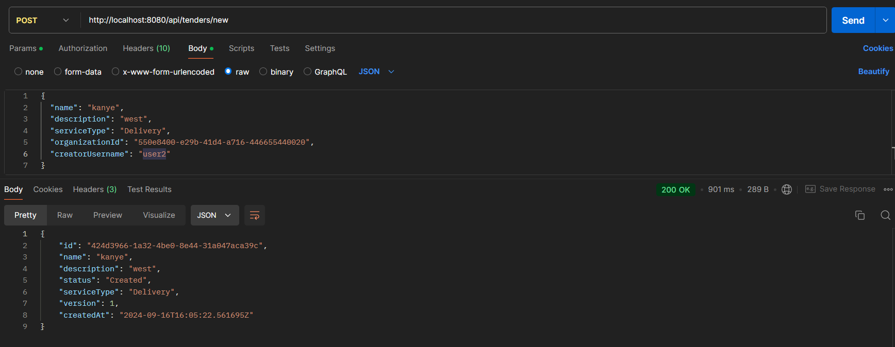


* GET /api/tenders - Получение списка всех доступных тендеров (Можно получить только тендеры у которых статус "Published"(те которые доступные всем пользователям. Было задано в условии), остальные тендеры будут недоступны)

Также в query можно задать service_type,limit,offset через ```https://localhost:8080/api/tenders?service_type={}&limit={}&offset={}``` , где {} -это место куда можно вставить значения

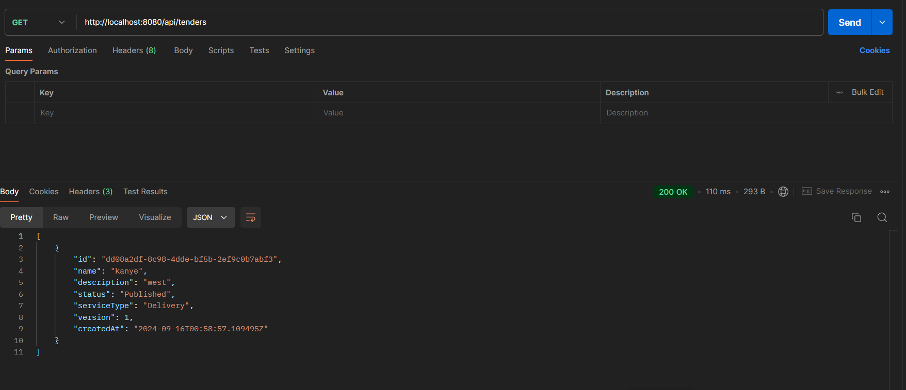

* GET /api/tenders/my?username={} - Получить тендеры пользователя
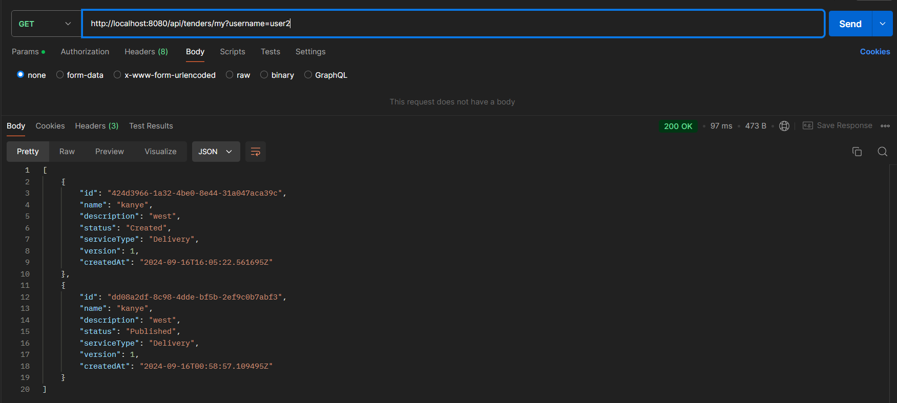

* GET  /api/tenders/{tenderId}/status - Получение текущего статуса тендера

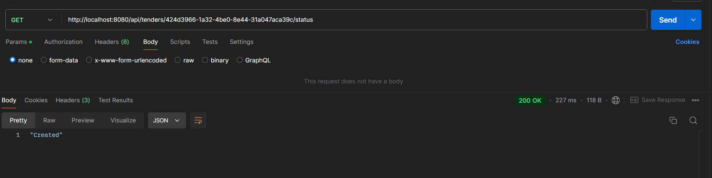

* PUT /api/tenders/{tenderId}/status?username={}&status={} - Изменить статус тендера по его идентификатору.(Добавил query username(так как в документации было "required"),без этого параметра и tenderId невозможно поменять статус.Сделал как было в документации openapi.yml )

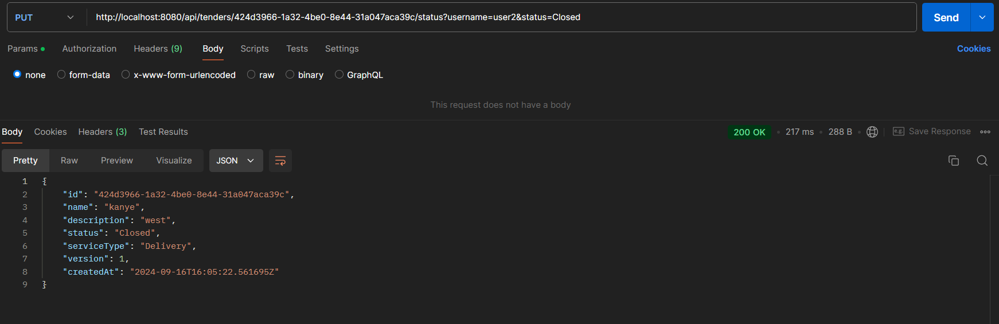

* PATCH /api/tenders/{tenderId}/edit?username={} - Изменение параметров существующего тендера. (Тоже параметр username "*required")
  
request JSON body struct(если не передавать то тендер останется без изменений:

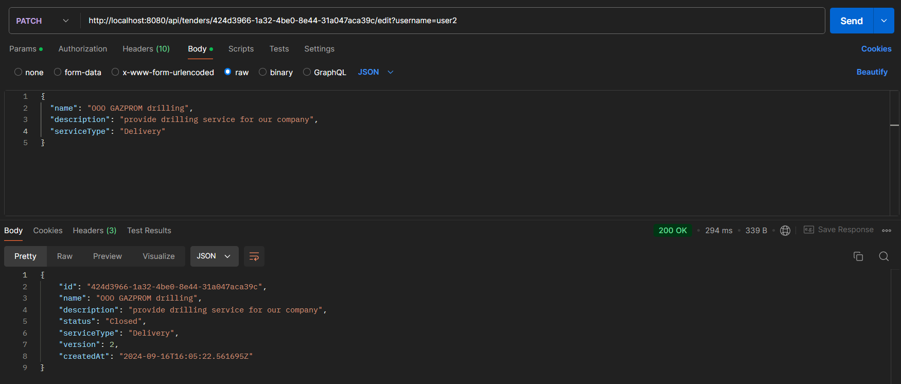


### Предложения:

* POST /api/bids/new - Создание нового предложения

request JSON body struct(required):
```json lines
{
  "name": "string",
  "description": "string",
  "tenderId": "550e8400-e29b-41d4-a716-446655440000",
  "authorType": "Organization",
  "authorId": "550e8400-e29b-41d4-a716-446655440000" 
}
```
authorId - обязательно передаем employee(id) связанный с organization 

Ответ:
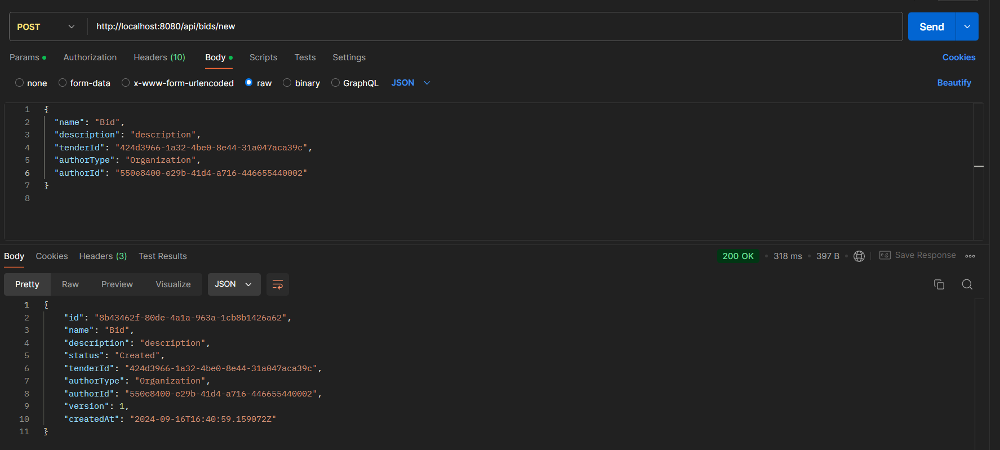


* GET /api/bids/my?username={} - Получение списка ваших предложений по username(Можно так же в query параметрах задать limit и offset)

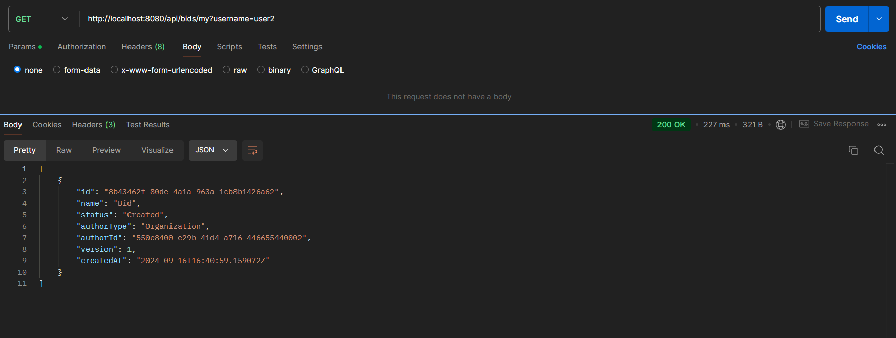

* GET /api/bids/{tenderId}/list?username={} - Получение списка предложений для тендера (Можно также в параметрах задать limit и offset)
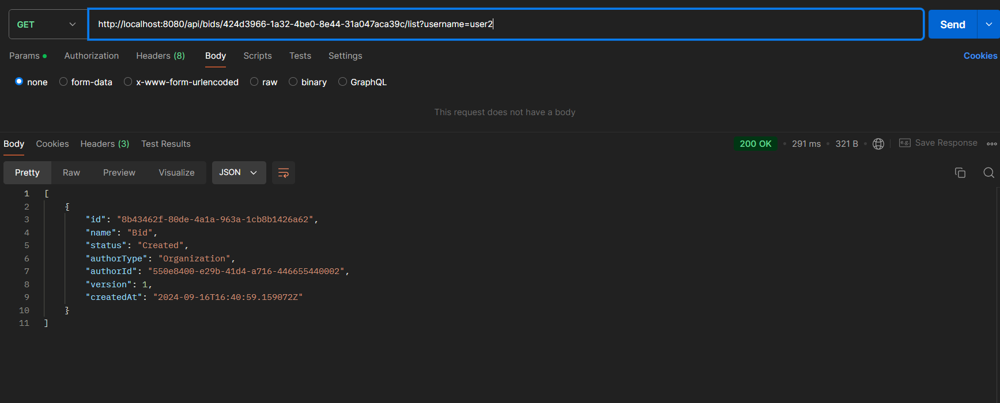

* GET /api/bids/{bidId}/status?username={} - Получить статус предложения по его уникальному идентификатору и по username.

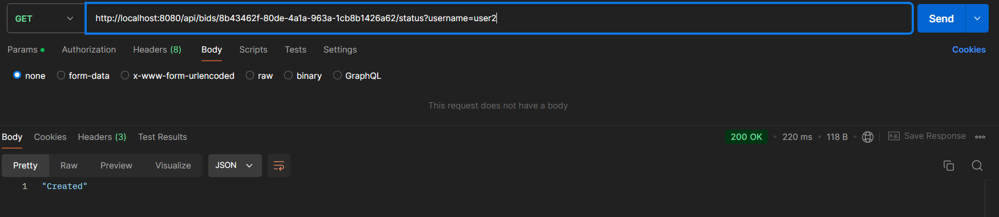

* PUT /api/bids/{bidId}/status?username={}&status={} - Изменить статус предложения по его уникальному идентификатору и по username.

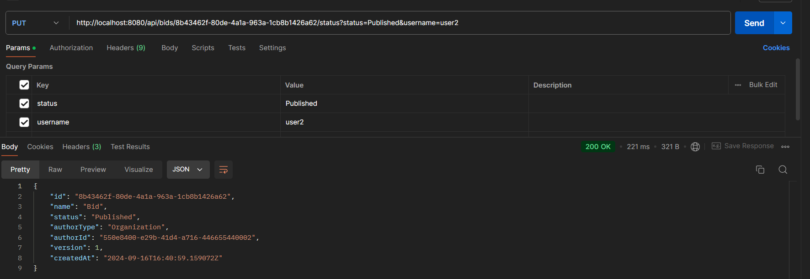

* PATCH /api/bids/{bidId}/edit?username={} - Редактирование существующего предложения.

request JSON body struct:
```json lines
{
  "name": "string",
  "description": "string"
}
```
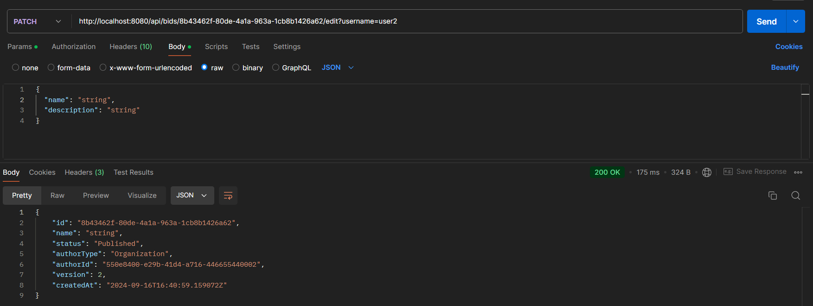

##  Вопросы
1. в документации openapi в некоторых местах обязательно требуется username(required), а в некоторых нет(не совсем понятно почему так сделано).
2. 2 доп метода(submit decision,rollback) - не совсем понятно как реализовать

## To upgrade:
1. Доп.методы
2. Обработка ошибок + обработчик


